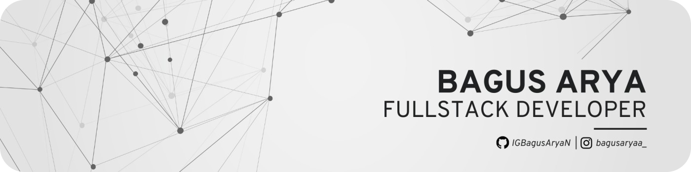

  

<!-- <h1 align="center">Hi👋, I’m Arya </h1> -->

<!--  -->

I'm passionate Full-Stack Developer skilled in React, TypeScript, and Node.js,
focused on building high-performance and user-friendly web applications.

- 💻 I’m currently learning and improving my skills in web development.

- 🧠 Comfortable working with JavaScript, TypeScript, and databases using SQL.

- 🚀 Currently exploring Laravel to expand my backend knowledge.

- 🛠 I enjoy building clean, structured, and useful applications.

- 🎯 Always focused on writing better code and learning something new.

---

###  Connect with me 📫

  
  
  

---

### Techstack🚀

            

---

